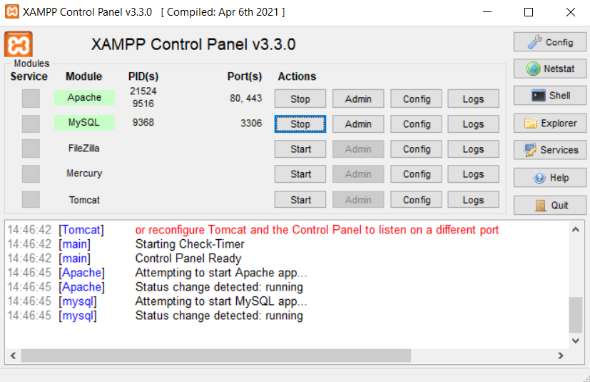
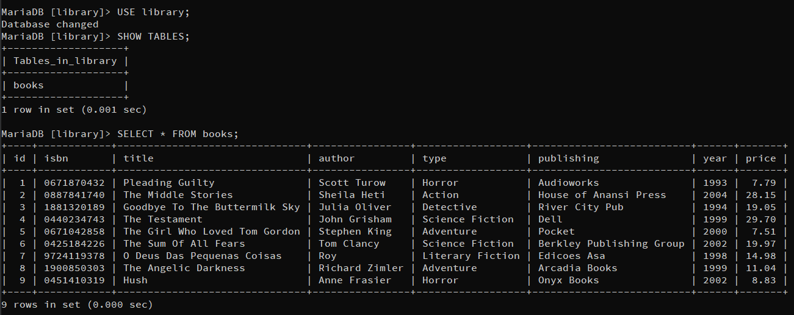
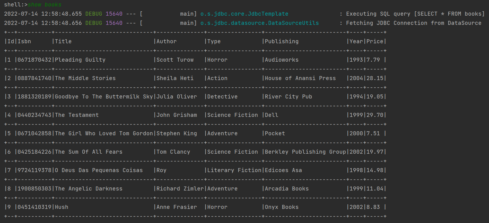
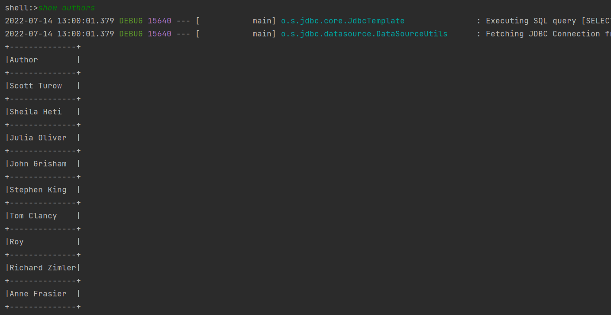
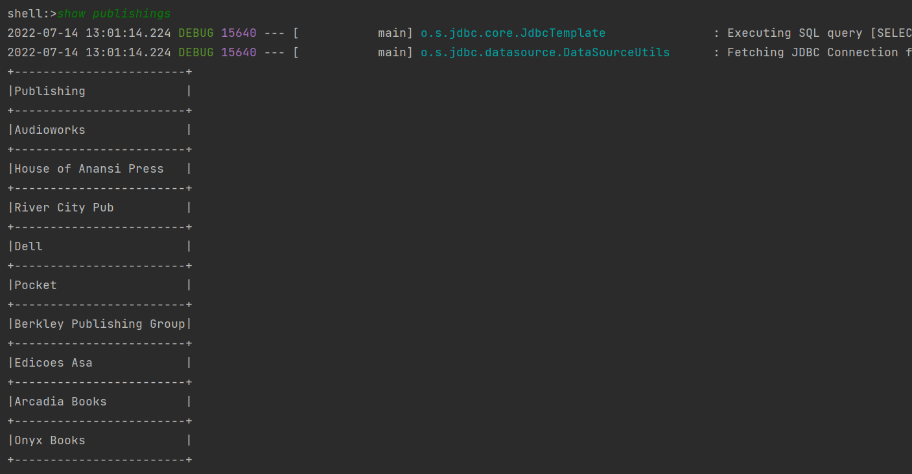
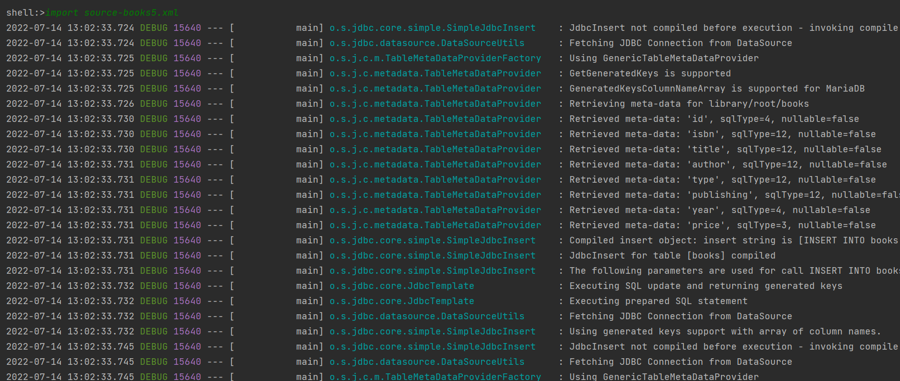

# Book management in library
Project created using Maven and Java. The application support CUI in Spring.

## Download
Use version control system [git](https://git-scm.com/) to clone this repository:
```
git clone ...
```

## Database in MariaDB
During using the application MySQL and Apache must be running


Create a database
``` sql
CREATE DATABASE library;
USE library;
CREATE TABLE books (
id INT AUTO_INCREMENT PRIMARY KEY,
isbn VARCHAR(100) NOT NULL,
title VARCHAR(100) NOT NULL,
author VARCHAR(100) NOT NULL,
type VARCHAR(100) NOT NULL,
publishing VARCHAR(100) NOT NULL,
year INT NOT NULL,
price DECIMAL (5,2) NOT NULL);
```

After uploading books it looks like this:


## Available operations:
- **Display the list of books in the database**
    ```
    show books
    ```
    


- **Display the list of the authors of the books in the database**
    ```
    show authors
    ```
    


- **Display the list of book publishers in the database**
    ```
    show publishings
    ```
    


- **Upload new books from XML file**\
    Use example XML files
    ```
    import source-books*.xml
    ```
    

## Detailed description of the project
The Book Management System loads XML files with all information about books added to the library. Saves the necessary information in a database. The command user interface is used to perform operations - such as e.g. displaying a list of books currently stored in the library, displaying all authors of the books, displaying all book publishers, uploading new books from XML files.
